# A500_IDE_LED_board
Amiga 500 Floppy LED to Display IDE Activity too

Connect a fly-lead from IDE pin 39 /Active to J4 if U1 (74HCT2G14) is not populated, otherwise to J3

<a href="images/A500_IDE_LED_board_pic1.png">
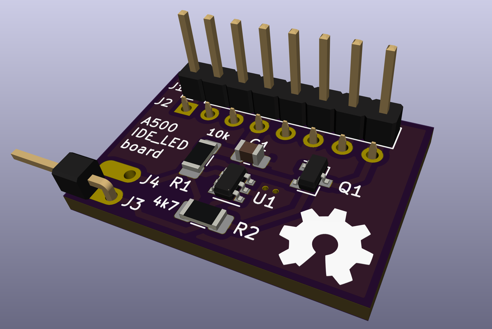
</a>
 
<a href="images/A500_IDE_LED_board_pic2.png">
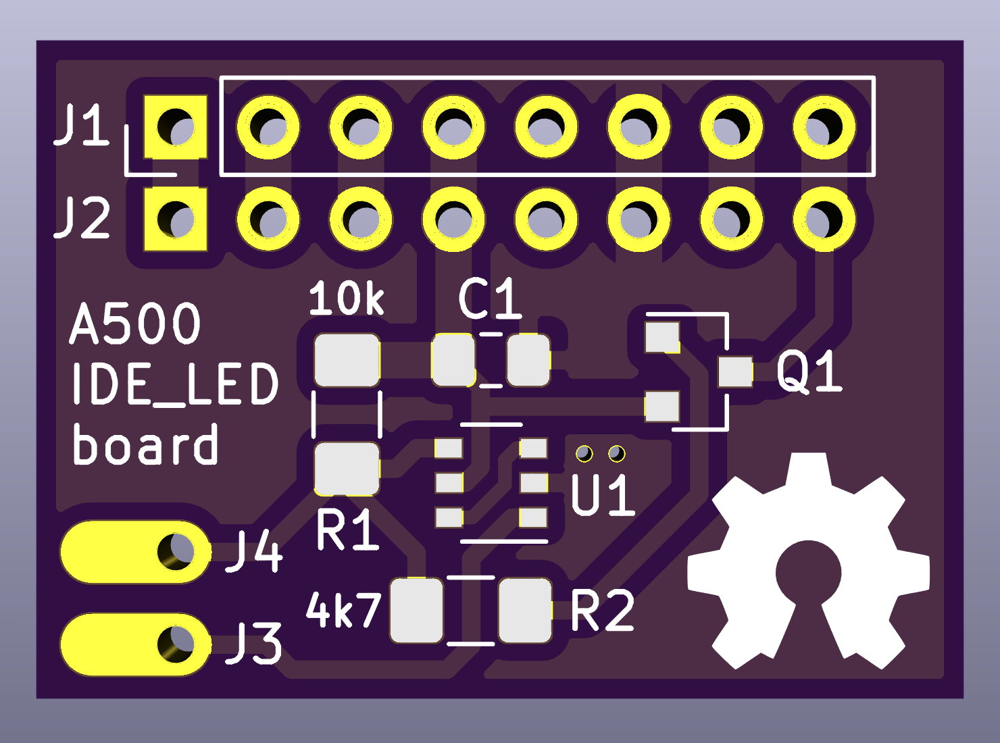
</a>
<a href="images/A500_IDE_LED_board_pic3.png">
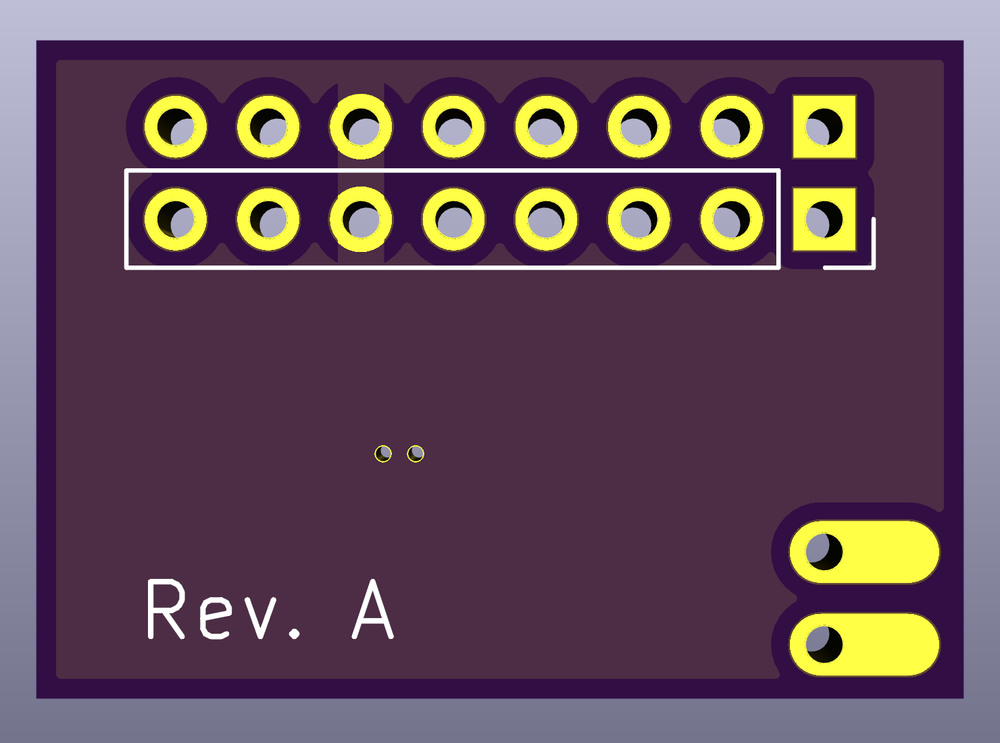
</a>

***

<a href="images/A500_IDE_LED_board_pic4.jpg">
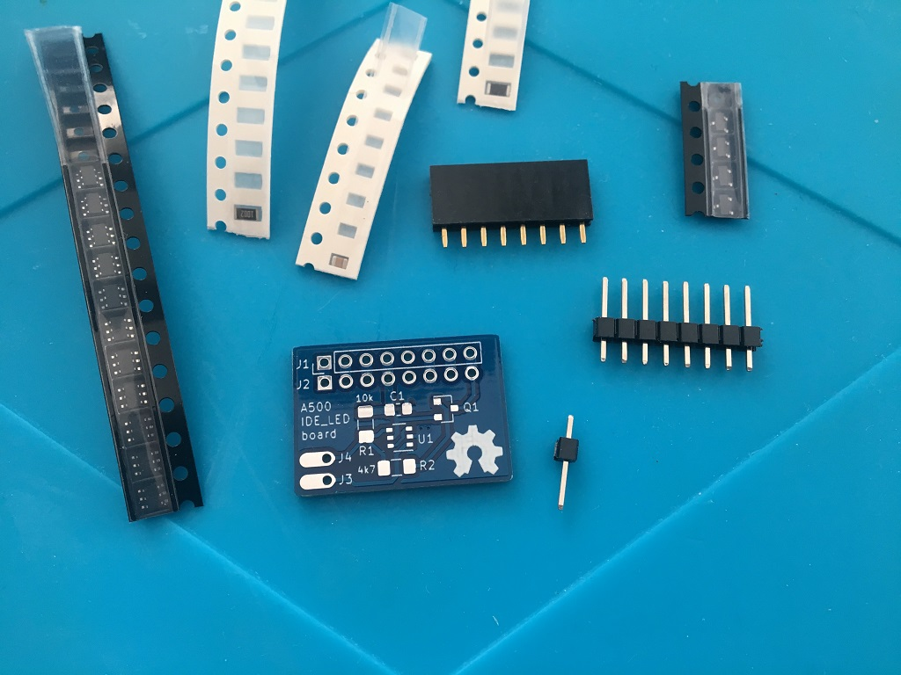
</a>
<a href="images/A500_IDE_LED_board_pic5.jpg">
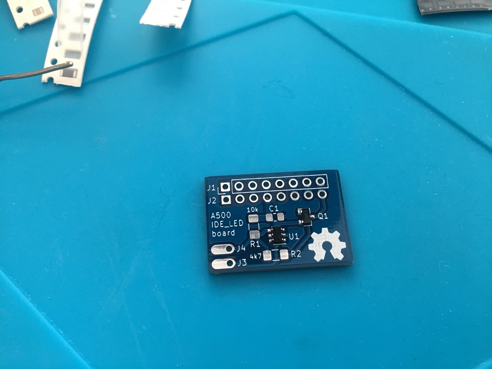
</a>
<a href="images/A500_IDE_LED_board_pic6.jpg">
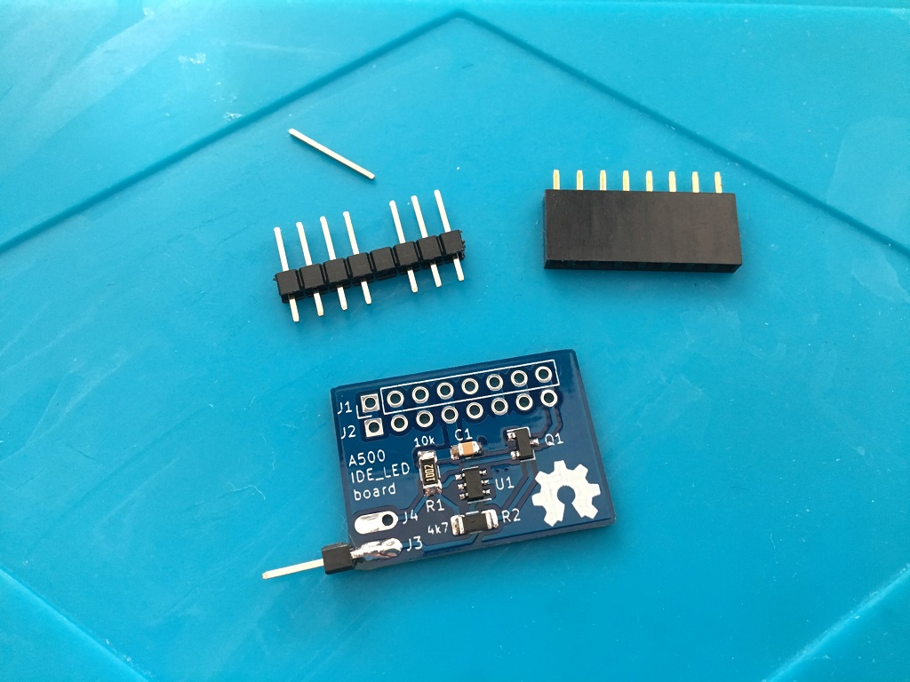
</a>

***

<a href="images/A500_IDE_LED_board_pic7.jpg">
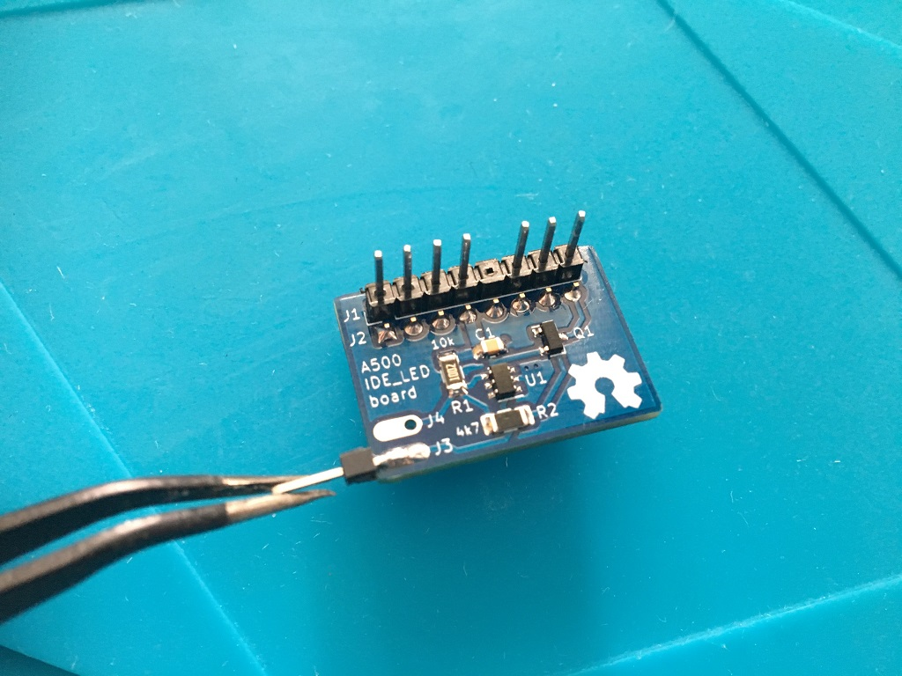
</a>
<a href="images/A500_IDE_LED_board_pic8.jpg">
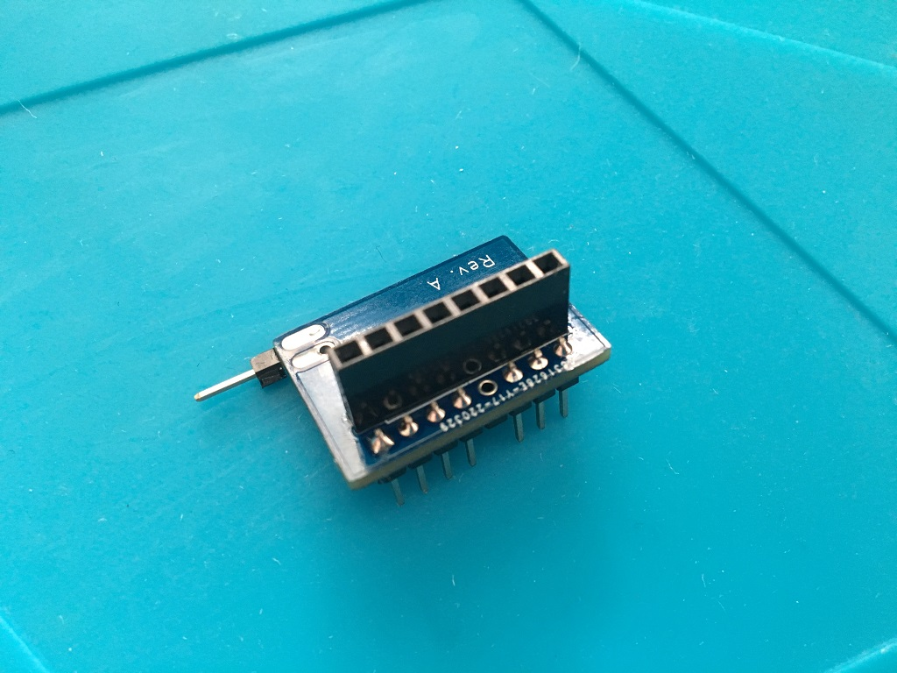
</a>
<a href="images/A500_IDE_LED_board_pic9.jpg">
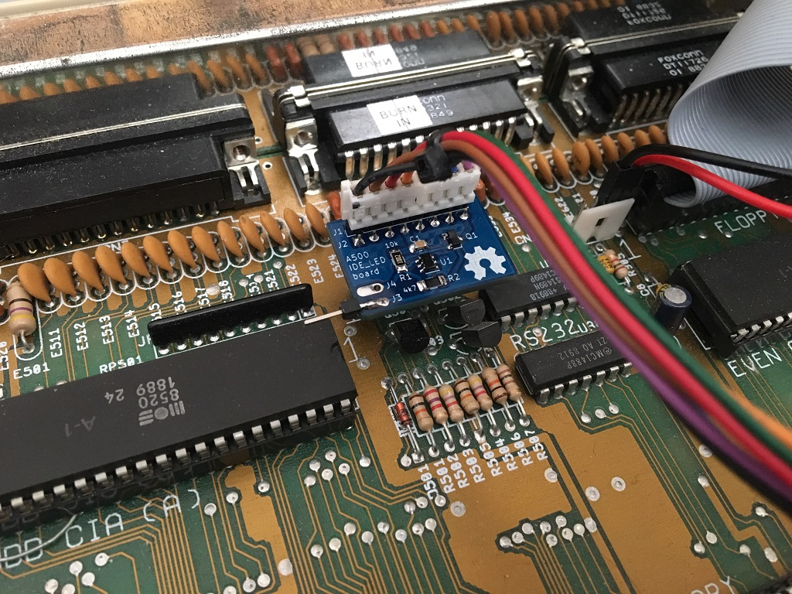
</a>

***
Connect a fly-lead from IDE pin 39 /Active
***

<a href="images/A500_IDE_LED_board_pic11.jpg">
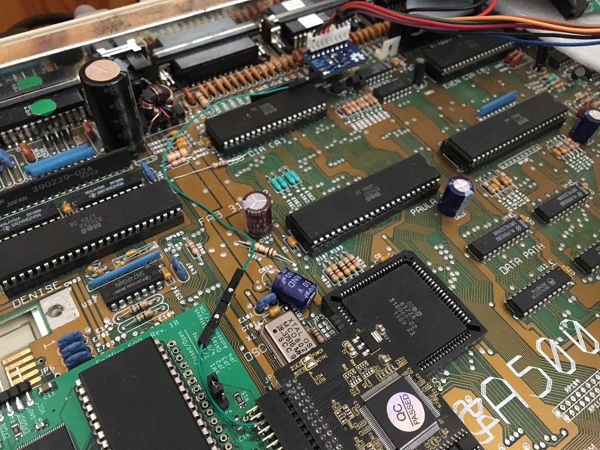
</a>
<a href="images/A500_IDE_LED_board_pic10.jpg">
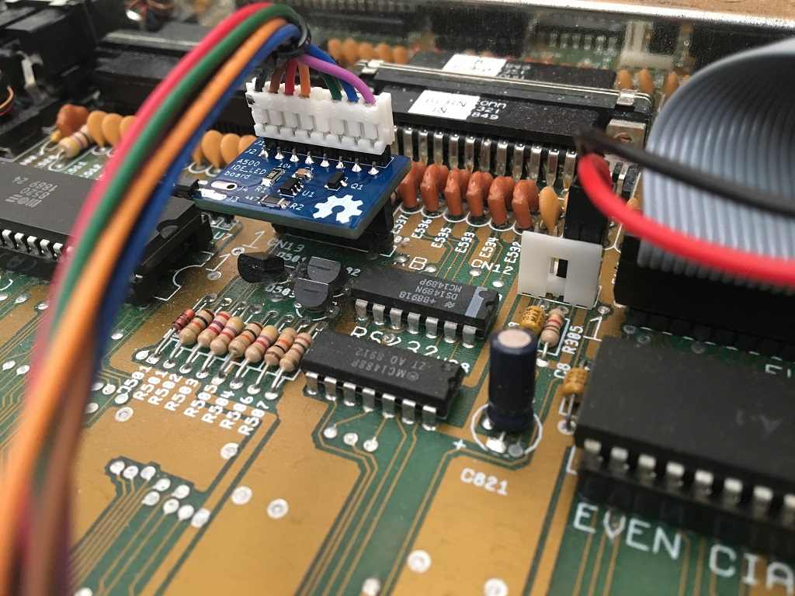
</a>

***

Video:  
https://drive.google.com/file/d/1Ml881xZoqoM8HT1IZ48qTFUnri6tXyhQ/view?usp=sharing

***

The individual pins in the pin-strip can be moved/pushed flush with the PCB holes before soldering. This is not necessary to do connection wise but it looks kind of nice when the bare pins are about the same length as the keyboard header on the Motherboard:

<a href="images/A500_IDE_LED_board_pic12.jpg">
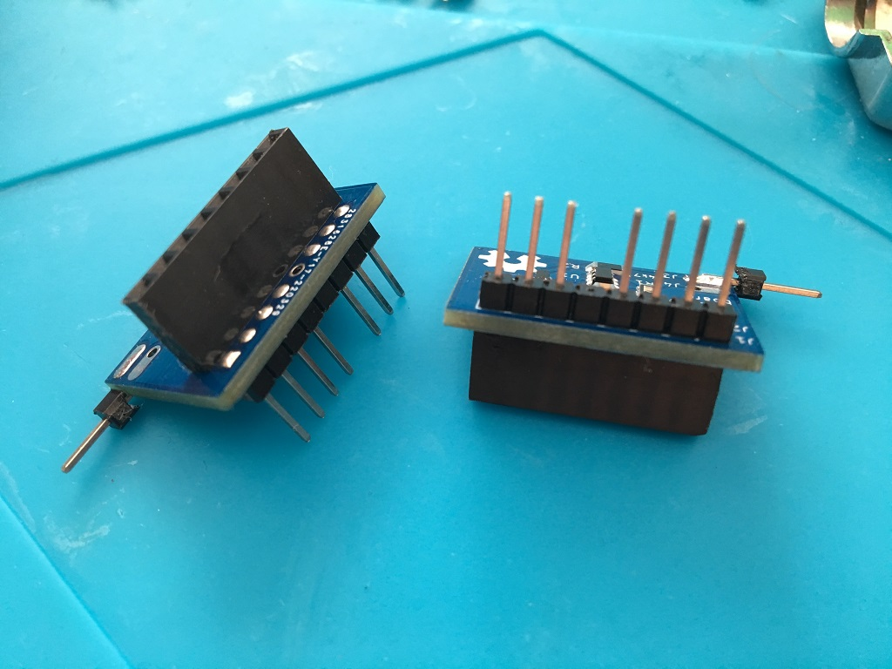
</a>

***

BOM Rev. A
---------
Position  | Name/Value   | Package | Notes
-|-|-|-|
U1 | 74HCT2G14 | TSOP-6 | Dual inverting Schmitt trigger
Q1 | BC857 or similar e.g. 2N3906 | SOT-23 | PNP general-purpose transistor
R1 | 10k | 1206 | Pull-up resistor
R2 | 4.7k | 1206 | Series resistor
C1 | 0.1uF = 100nF | 0805 | Decoupling capacitor
J1 | PinHeader_1x08_P2.54mm_Vertical | Single row 8pin | Pin 5 is not used and can be removed
J2 | PinSocket_1x08_P2.54mm_Vertical | Single row 8pin |
J3 | PinHeader_1x01_P2.54mm | Single pin | 
J4 | PinHeader_1x01_P2.54mm | Single pin |

***

[![CC BY-SA 4.0][cc-by-sa-shield]][cc-by-sa]

This work is licensed under a
[Creative Commons Attribution-ShareAlike 4.0 International License][cc-by-sa].

[![CC BY-SA 4.0][cc-by-sa-image]][cc-by-sa]

[cc-by-sa]: http://creativecommons.org/licenses/by-sa/4.0/
[cc-by-sa-image]: https://licensebuttons.net/l/by-sa/4.0/88x31.png
[cc-by-sa-shield]: https://img.shields.io/badge/License-CC%20BY--SA%204.0-lightgrey.svg
